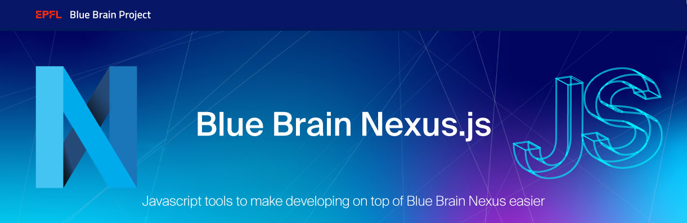

# Nexus.js

 

  <a href="https://www.epfl.ch/research/domains/bluebrain/">Blue Brain Project</a> |
  <a href="https://bluebrainnexus.io">Nexus</a> |
  <a href="https://bluebrainnexus.io/docs/">Nexus API Docs</a> |
  <a href="https://sandbox.bluebrainnexus.io">Sandbox</a>
</a>

  <a href="https://codesandbox.io/search?refinementList%5Btags%5D%5B0%5D=bluebrainnexus&page=1&configure%5BhitsPerPage%5D=12">Examples</a> |
  <a href="#Packages">Packages</a> |
  <a href="#Development">Development</a> |
  <a href="#License">License</a>

Javascript tools to make developing on top of <a href="https://bluebrainnexus.io">Blue Brain Nexus</a> easier.

## Packages

### [`@bbp/nexus-sdk`](./packages/nexus-sdk/README.md#readme)

An abstracted sdk layer over Blue Brain Nexus to make developing clients and services more simple.

[npm](https://www.npmjs.com/package/@bbp/nexus-sdk) | [Readme](./packages/nexus-sdk#readme)

### [`@bbp/react-nexus`](./packages/react-nexus/README.md#readme)

A set of react tools to allow an easier and faster integration with Nexus.

[npm](https://www.npmjs.com/package/@bbp/react-nexus) | [Readme](./packages/react-nexus#readme)

### [`@bbp/nexus-link`](./packages/nexus-link/README.md#readme)

The core of `nexus-sdk`, this library allows to control the request/response flow by chaining "middlewares". It uses the Observable pattern which allows to contain the request/response logic into 1 function called "links".

[npm](https://www.npmjs.com/package/@bbp/nexus-link) | [Readme](./packages/nexus-link#readme)

#### How is the repo structured?

This repo is managed as a _monorepo_ using [lerna](https://github.com/lerna/lerna) that is composed of multiple npm packages.

## Development

> Make sure you perform the make actions in the repository root directory!

### Using Docker

> If you don't have Node.js installed on your machine, you can run a "docker shell" with `make dshell` from which you'll have a fully working Node.js environment.
> Make sure you have already installed both [Docker Engine](https://docs.docker.com/install/) and [Docker Compose](https://docs.docker.com/compose/install/).

### Do things

- Install: `make install`
- Build: `make build`
- Test: `make test`
- Lint: `make lint`

## License

[Apache License, Version 2.0](https://www.apache.org/licenses/LICENSE-2.0)

## Funding & Acknowledgment

The development of this software was supported by funding to the Blue Brain Project, a research center of the École polytechnique fédérale de
Lausanne (EPFL), from the Swiss government's ETH Board of the Swiss Federal Institutes of Technology.

Copyright © 2015-2022 Blue Brain Project/EPFL

